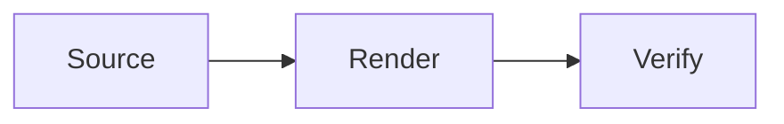

# Complete Markdown & GitHub Flavored Markdown Cheat Sheet

> **Reviewed:** 19 July 2026<br>
> **Baseline:** CommonMark 0.31.2, GFM 0.29-gfm, and current GitHub.com documentation and rendering behaviour.

This guide separates three related layers:

| Layer | Meaning |
|---|---|
| **CommonMark** | The portable core syntax most modern Markdown renderers share. |
| **GFM** | GitHub Flavored Markdown extensions formally defined by GitHub, including tables, task lists, strikethrough, and extended autolinks. |
| **GitHub.com** | Extra site features such as alerts, footnotes, math, diagrams, mentions, issue references, and collapsible sections. |

> [!IMPORTANT]
> Not every feature rendered by GitHub.com belongs to the formal GFM specification. GitHub-only features may appear as plain text on other Markdown platforms.

Feature demonstrations show the literal **Source** followed by their **Rendered on GitHub** result. Features that depend on a repository, account, or conversation context instead show an **Expected on GitHub** description.

---

## Table of contents

- [1. Quick-reference table](#1-quick-reference-table)
- [2. Paragraphs and line breaks](#2-paragraphs-and-line-breaks)
- [3. Headings and section links](#3-headings-and-section-links)
- [4. Text styles](#4-text-styles)
- [5. Horizontal rules](#5-horizontal-rules)
- [6. Block quotes](#6-block-quotes)
- [7. Lists](#7-lists)
- [8. Task lists](#8-task-lists)
- [9. Inline code and code blocks](#9-inline-code-and-code-blocks)
- [10. Links](#10-links)
- [11. Images](#11-images)
- [12. Tables](#12-tables)
- [13. Escaping and literal text](#13-escaping-and-literal-text)
- [14. HTML and hidden comments](#14-html-and-hidden-comments)
- [15. Footnotes](#15-footnotes)
- [16. GitHub alerts](#16-github-alerts)
- [17. Collapsible sections](#17-collapsible-sections)
- [18. Mentions, references, and autolinks](#18-mentions-references-and-autolinks)
- [19. Emoji](#19-emoji)
- [20. Colour previews](#20-colour-previews)
- [21. Mathematical expressions](#21-mathematical-expressions)
- [22. Diagrams, maps, and 3D models](#22-diagrams-maps-and-3d-models)
- [23. Common mistakes and portability limits](#23-common-mistakes-and-portability-limits)
- [24. Sources and maintenance notes](#24-sources-and-maintenance-notes)
- [Compact copy/paste reference](#compact-copypaste-reference)

---

## 1. Quick-reference table

| Feature | Source | Layer |
|---|---|---|
| Heading | `## Heading` | CommonMark |
| Bold | `**bold**` | CommonMark |
| Italic | `*italic*` | CommonMark |
| Bold italic | `***bold italic***` | CommonMark |
| Strikethrough | `~~removed~~` | GFM |
| Inline code | `` `code` `` | CommonMark |
| Link | `[label](https://example.com)` | CommonMark |
| Image | `` | CommonMark |
| Block quote | `> Quoted text` | CommonMark |
| Bullet list | `- Item` | CommonMark |
| Numbered list | `1. Item` | CommonMark |
| Task item | `- [x] Done` | GFM |
| Table | Pipes plus a delimiter row | GFM |
| Footnote | `Text[^1]` and `[^1]: Note` | GitHub.com |
| Alert | `> [!NOTE]` | GitHub.com |
| Collapsible section | `<details>` and `<summary>` | GitHub.com HTML |
| Inline math | `$x^2$` | GitHub.com |
| Mermaid diagram | Fenced block tagged `mermaid` | GitHub.com |

---

## 2. Paragraphs and line breaks

### 2.1 Paragraphs

Separate paragraphs with a blank line.

**Source**

```markdown
First paragraph.

Second paragraph.
```

**Rendered on GitHub**

First paragraph.

Second paragraph.

### 2.2 Soft line breaks

In a `.md` file, a single source newline normally becomes a space in the rendered paragraph.

**Source**

```markdown
First source line.
Second source line.
```

**Rendered on GitHub**

First source line.
Second source line.

GitHub issue, pull-request, and discussion fields may preserve ordinary newlines differently from repository Markdown files.

### 2.3 Hard line breaks

Use two trailing spaces, a trailing backslash, or `<br>`.

**Source**

```markdown
First line with two trailing spaces.␠␠
Second line.

Third line with a backslash.\
Fourth line.

Fifth line.<br>
Sixth line.
```

**Rendered on GitHub**

First line with two trailing spaces.<br>
Second line.

Third line with a backslash.\
Fourth line.

Fifth line.<br>
Sixth line.

In the first source example, `␠␠` represents two literal space characters immediately before the newline.

---

## 3. Headings and section links

### 3.1 ATX headings

CommonMark supports six levels. Include a space after the `#` characters.

**Source**

```markdown
# Level 1
## Level 2
### Level 3
#### Level 4
##### Level 5
###### Level 6
```

**Rendered on GitHub**

### Level 3 example

#### Level 4 example

##### Level 5 example

###### Level 6 example

Use one level-one heading as the document title, then descend through levels without skipping when practical.

### 3.2 Setext headings

Setext syntax supports only levels 1 and 2.

**Source**

```markdown
Level 1
===

Level 2
-------
```

**Rendered on GitHub**

Level 2 example
---------------

### 3.3 Automatic section links

GitHub generates an anchor for each heading. Hover over a rendered heading and use its link icon to copy the exact URL.

**Source**

```markdown
## Installation and setup

[Jump to setup](#installation-and-setup)
```

**Rendered on GitHub**

[Jump to this guide's text-styles section](#4-text-styles)

Duplicate heading anchors normally receive suffixes such as `-1` and `-2`. Editing or reordering headings can therefore break manually written section links.

### 3.4 Custom anchors

**Source**

```markdown
<a name="custom-destination"></a>

[Jump to the custom destination](#custom-destination)
```

Custom anchors work on GitHub but do not appear in the automatic document outline.

---

## 4. Text styles

### 4.1 Core styles

| Style | Source | Rendered on GitHub |
|---|---|---|
| Bold | `**bold**` or `__bold__` | **bold** |
| Italic | `*italic*` or `_italic_` | *italic* |
| Bold italic | `***bold italic***` | ***bold italic*** |
| Strikethrough | `~~removed~~` | ~~removed~~ |
| Nested style | `**bold with _italic_**` | **bold with _italic_** |

Use double tildes for strikethrough. A single tilde may work on GitHub.com, but `~~text~~` is the safer GFM form across renderers.

### 4.2 Subscript, superscript, and underline

These use GitHub-supported HTML rather than portable Markdown syntax.

**Source**

```markdown
H<sub>2</sub>O

x<sup>2</sup>

<ins>Underlined text</ins>
```

**Rendered on GitHub**

H<sub>2</sub>O

x<sup>2</sup>

<ins>Underlined text</ins>

Markdown has no portable built-in syntax for underline, subscript, superscript, highlighting, or text colour.

---

## 5. Horizontal rules

Use three or more hyphens, asterisks, or underscores on a line by themselves.

**Source**

```markdown
---

***

___
```

**Rendered on GitHub**

---

Avoid placing `---` directly beneath ordinary text unless you intend to create a level-two Setext heading.

---

## 6. Block quotes

### 6.1 Basic quote

**Source**

```markdown
> This is quoted text.
>
> It can contain more than one paragraph.
```

**Rendered on GitHub**

> This is quoted text.
>
> It can contain more than one paragraph.

### 6.2 Nested quote

**Source**

```markdown
> First level
>
> > Second level
```

**Rendered on GitHub**

> First level
>
> > Second level

---

## 7. Lists

### 7.1 Unordered lists

**Source**

```markdown
- First item
- Second item
  - Nested item
  - Another nested item
```

**Rendered on GitHub**

- First item
- Second item
  - Nested item
  - Another nested item

`*` and `+` are also valid unordered-list markers. Using one marker style consistently keeps source tidy.

### 7.2 Ordered lists

**Source**

```markdown
1. First item
2. Second item
3. Third item
```

**Rendered on GitHub**

1. First item
2. Second item
3. Third item

The first source number controls the displayed starting number. Later source numbers do not need to be sequential.

**Source**

```markdown
5. Fifth item
1. Sixth item after rendering
1. Seventh item after rendering
```

**Rendered on GitHub**

5. Fifth item
1. Sixth item after rendering
1. Seventh item after rendering

Under CommonMark, only an ordered list starting with `1.` can interrupt an existing paragraph without a blank line. A blank line before every list is clearer and more portable.

### 7.3 Content inside list items

Indent continuation text and nested blocks far enough to belong to the item.

**Source**

````markdown
1. Install the package.

   ```shell
   npm install example
   ```

2. Run the command.
````

**Rendered on GitHub**

1. Install the package.

   ```shell
   npm install example
   ```

2. Run the command.

---

## 8. Task lists

Use `[ ]` for an open item and `[x]` or `[X]` for a completed item.

**Source**

```markdown
- [x] Audit the syntax
- [ ] Update the documentation
  - [ ] Verify the rendered output
```

**Rendered on GitHub**

- [x] Audit the syntax
- [ ] Update the documentation
  - [ ] Verify the rendered output

The checkbox is interactive only in supported GitHub contexts and with suitable permissions. In ordinary rendered files, it may be display-only.

If an item begins with parentheses, escape the opening parenthesis:

```markdown
- [ ] \(Optional) Run the extended tests
```

---

## 9. Inline code and code blocks

### 9.1 Inline code

**Source**

```markdown
Run `git status` before committing.
```

**Rendered on GitHub**

Run `git status` before committing.

To include a backtick, use a longer backtick delimiter:

**Source**

```markdown
``Use a `backtick` here``
```

**Rendered on GitHub**

``Use a `backtick` here``

### 9.2 Fenced code blocks

**Source**

````markdown
```javascript
const enabled = true;
console.log(enabled);
```
````

**Rendered on GitHub**

```javascript
const enabled = true;
console.log(enabled);
```

Use a lower-case language identifier for the best GitHub Pages compatibility. GitHub uses Linguist to map identifiers to highlighting grammars.

### 9.3 Tilde fences

CommonMark also accepts tilde fences.

**Source**

```markdown
~~~json
{"enabled": true}
~~~
```

**Rendered on GitHub**

~~~json
{"enabled": true}
~~~

### 9.4 Indented code blocks

Four leading spaces create a code block, though fenced blocks are usually clearer.

**Source**

```markdown
    plain indented code
```

**Rendered on GitHub**

    plain indented code

### 9.5 Showing code fences literally

Wrap a triple-backtick example in four backticks or a longer tilde fence.

**Source**

`````markdown
````markdown
```text
literal fenced block
```
````
`````

---

## 10. Links

### 10.1 Inline links and titles

**Source**

```markdown
[GitHub](https://github.com)

[GitHub with a title](https://github.com "Visit GitHub")
```

**Rendered on GitHub**

[GitHub](https://github.com)

[GitHub with a title](https://github.com "Visit GitHub")

Keep link text on one source line. GitHub does not reliably parse a link label split across source lines.

### 10.2 Reference-style links

**Source**

```markdown
Read the [formatting guide][guide].

[guide]: https://docs.github.com/en/get-started/writing-on-github "GitHub formatting documentation"
```

**Rendered on GitHub**

Read the [formatting guide][formatting-guide].

[formatting-guide]: https://docs.github.com/en/get-started/writing-on-github "GitHub formatting documentation"

Collapsed reference links (`[label][]`) and shortcut references (`[label]`) also work when a matching definition exists.

### 10.3 Automatic links

**Source**

```markdown
<https://github.com>

<docs@example.com>

https://github.com
```

**Rendered on GitHub**

<https://github.com>

<docs@example.com>

https://github.com

Angle-bracket autolinks are part of CommonMark. Automatic linking of a bare URL is a GFM extension.

### 10.4 Relative repository links

**Source from a root README**

```markdown
[Contributing guide](docs/CONTRIBUTING.md)
[Licence](/LICENSE)
```

Relative links follow the branch or commit currently being viewed and also work in local clones. A leading `/` is relative to the repository root on GitHub.

---

## 11. Images

### 11.1 Basic image

**Source**

```markdown

```

**Rendered on GitHub**


Always provide meaningful alt text. For a purely decorative image, use empty alt text: ``.

### 11.2 Linked image

**Source**

```markdown
[](https://github.com)
```

**Rendered on GitHub**

[](https://github.com)

### 11.3 Relative images

**Source from `docs/guide.md`**

```markdown

```

GitHub resolves the path relative to the current Markdown file. Relative paths are preferable for repository-owned assets.

### 11.4 Theme-aware images

GitHub documents the HTML `<picture>` element for selecting light- and dark-theme images.

**Source**

```html
<picture>
  <source media="(prefers-color-scheme: dark)" srcset="dark.png">
  <source media="(prefers-color-scheme: light)" srcset="light.png">
  
</picture>
```

This is GitHub-supported HTML, not portable Markdown.

---

## 12. Tables

Include a blank line before a table. GitHub's documented style uses at least three hyphens per delimiter cell; the formal GFM grammar and current GitHub parser accept one or more. Three is the clearest and most portable choice.

### 12.1 Basic table

**Source**

```markdown
| Command | Description |
|---|---|
| `git status` | Show working-tree status |
| `git diff` | Show unstaged differences |
```

**Rendered on GitHub**

| Command | Description |
|---|---|
| `git status` | Show working-tree status |
| `git diff` | Show unstaged differences |

Outer pipes are optional, but using them often makes the source easier to scan.

### 12.2 Column alignment

**Source**

```markdown
| Left | Centre | Right |
|:---|:---:|---:|
| A | B | 10 |
| C | D | 200 |
```

**Rendered on GitHub**

| Left | Centre | Right |
|:---|:---:|---:|
| A | B | 10 |
| C | D | 200 |

### 12.3 Literal pipes

Escape a pipe inside a table cell.

**Source**

```markdown
| Character | Source |
|---|---|
| Pipe | `\|` |
```

**Rendered on GitHub**

| Character | Source |
|---|---|
| Pipe | `\|` |

Tables do not support multi-line or block-level content reliably. Use HTML or restructure the content when a cell needs lists, paragraphs, or fenced code blocks.

---

## 13. Escaping and literal text

### 13.1 Backslash escapes

Place a backslash before an ASCII punctuation character that would otherwise trigger Markdown.

**Source**

```markdown
\*literal asterisks\*

\# not a heading

1\. not a list item
```

**Rendered on GitHub**

\*literal asterisks\*

\# not a heading

1\. not a list item

### 13.2 Character entities

HTML character references are another way to show reserved characters.

**Source**

```markdown
&lt;tag&gt; &amp; &#35;
```

**Rendered on GitHub**

&lt;tag&gt; &amp; &#35;

### 13.3 Safest literal display

Use inline code or a fenced code block for complex source that must remain unchanged.

---

## 14. HTML and hidden comments

### 14.1 Hidden comments

**Source**

```markdown
Visible before.

<!-- This note is present in the source but hidden when rendered. -->

Visible after.
```

**Rendered on GitHub**

Visible before.

<!-- This note is present in the source but hidden when rendered. -->

Visible after.

Do not place secrets in comments. Hidden comments remain visible in the raw file and Git history.

### 14.2 Raw HTML limits

GitHub parses raw HTML and then sanitises it. This is **not** unrestricted browser HTML: unsupported elements are removed, unsafe URL schemes are rejected, and attributes such as `style`, `class`, and `onclick` are stripped.

The examples below were checked with GitHub's current Markdown renderer on 19 July 2026. GitHub documents several useful elements, but does not publish a permanent exhaustive GitHub.com allowlist. Treat the inventory in section 14.10 as a current compatibility reference, not a web-platform guarantee.

Raw HTML is not portable and may behave differently in local previewers, documentation generators, and other Git forges.

### 14.3 Inline text formatting

Use Markdown for ordinary emphasis when possible. HTML is useful for underline, subscript, superscript, highlighting, or more explicit semantics.

**Raw source**

```html
<b>Bold appearance</b>
<strong>Strong importance</strong>
<i>Italic appearance</i>
<em>Emphasised text</em>
<ins>Inserted or underlined text</ins>
<del>Deleted text</del>
<s>Text no longer accurate</s>
<strike>Legacy strikethrough</strike>
H<sub>2</sub>O and x<sup>2</sup>
<mark>Highlighted text</mark>
<span title="Extra information">Text with a tooltip</span>
```

**Rendered example**

<b>Bold appearance</b><br>
<strong>Strong importance</strong><br>
<i>Italic appearance</i><br>
<em>Emphasised text</em><br>
<ins>Inserted or underlined text</ins><br>
<del>Deleted text</del><br>
<s>Text no longer accurate</s><br>
<strike>Legacy strikethrough</strike><br>
H<sub>2</sub>O and x<sup>2</sup><br>
<mark>Highlighted text</mark><br>
<span title="Extra information">Text with a tooltip</span>

Prefer `<strong>` and `<em>` when the emphasis has meaning, `<del>` for a deletion, and `<s>` for text that is merely no longer accurate. `<strike>` is obsolete HTML but currently survives GitHub sanitisation.

### 14.4 Code, keyboard input, output, and variables

**Raw source**

```html
Press <kbd>Command</kbd> + <kbd>K</kbd>.
The program prints <samp>Ready</samp>.
Let <var>n</var> be the item count.
Use <code>git status</code>.
<pre><code>line one
line two</code></pre>
<tt>Legacy teletype text</tt>
```

**Rendered example**

Press <kbd>Command</kbd> + <kbd>K</kbd>.<br>
The program prints <samp>Ready</samp>.<br>
Let <var>n</var> be the item count.<br>
Use <code>git status</code>.

<pre><code>line one
line two</code></pre>

<tt>Legacy teletype text</tt>

Prefer backticks and fenced code blocks for normal Markdown. `<tt>` is obsolete HTML; use `<code>` instead.

### 14.5 Links, custom anchors, and quotations

**Raw source**

```html
<a href="https://example.com" title="Example site">Example link</a>
<a name="html-anchor-example"></a>
<a href="#html-anchor-example">Jump to the custom anchor</a>

<q cite="https://example.com/source">Short inline quotation</q>

<blockquote cite="https://example.com/source">
  Longer block quotation
</blockquote>
```

**Rendered example**

<a href="https://example.com" title="Example site">Example link</a><br>
<a name="html-anchor-example"></a>
<a href="#html-anchor-example">Jump to the custom anchor</a>

<q cite="https://example.com/source">Short inline quotation</q>

<blockquote cite="https://example.com/source">
  Longer block quotation
</blockquote>

GitHub prefixes a custom anchor's final HTML `name` value internally, but links written as `#html-anchor-example` still work. Custom anchors do not appear in GitHub's automatic document outline.

### 14.6 Structure, line breaks, and simple alignment

**Raw source**

```html
<h6>HTML heading</h6>

<p>First line<br>Second line</p>

<hr>

<div align="center">Centred block</div>

<p align="right">Right-aligned paragraph</p>
```

**Rendered example**

<h6>HTML heading</h6>

<p>First line<br>Second line</p>

<hr>

<div align="center">Centred block</div>

<p align="right">Right-aligned paragraph</p>

`<h1>` through `<h6>`, `<p>`, `<div>`, `<span>`, `<br>`, and `<hr>` currently survive GitHub sanitisation. A `<span>` or `<div>` does not add custom styling by itself. The `align` attribute is legacy HTML and less portable than normal Markdown layout, even though GitHub currently retains it.

### 14.7 HTML lists and definition lists

HTML lists are useful when Markdown list syntax cannot express the required start value or definition-style structure.

**Raw source**

```html
<ul>
  <li>Unordered item</li>
  <li>Another item</li>
</ul>

<ol start="3">
  <li>Item three</li>
  <li>Item four</li>
</ol>

<dl>
  <dt>Term</dt>
  <dd>Definition of the term.</dd>
  <dt>Another term</dt>
  <dd>Another definition.</dd>
</dl>
```

**Rendered example**

<ul>
  <li>Unordered item</li>
  <li>Another item</li>
</ul>

<ol start="3">
  <li>Item three</li>
  <li>Item four</li>
</ol>

<dl>
  <dt>Term</dt>
  <dd>Definition of the term.</dd>
  <dt>Another term</dt>
  <dd>Another definition.</dd>
</dl>

GitHub currently accepts `<ul>`, `<ol>`, `<li>`, `<dl>`, `<dt>`, and `<dd>`. Definition lists are HTML-dependent and are not part of CommonMark or formal GFM.

### 14.8 HTML tables, spanning, and alignment

Use an HTML table when cells must span rows or columns. Pipe-table syntax cannot express `rowspan` or `colspan`.

**Raw source**

```html
<table>
  <thead>
    <tr>
      <th colspan="2" align="center">Project summary</th>
    </tr>
    <tr>
      <th>Field</th>
      <th>Value</th>
    </tr>
  </thead>
  <tbody>
    <tr>
      <td rowspan="2" valign="top">Status</td>
      <td>Ready</td>
    </tr>
    <tr>
      <td>Validated</td>
    </tr>
  </tbody>
  <tfoot>
    <tr>
      <td colspan="2">End of table</td>
    </tr>
  </tfoot>
</table>
```

**Rendered example**

<table>
  <thead>
    <tr>
      <th colspan="2" align="center">Project summary</th>
    </tr>
    <tr>
      <th>Field</th>
      <th>Value</th>
    </tr>
  </thead>
  <tbody>
    <tr>
      <td rowspan="2" valign="top">Status</td>
      <td>Ready</td>
    </tr>
    <tr>
      <td>Validated</td>
    </tr>
  </tbody>
  <tfoot>
    <tr>
      <td colspan="2">End of table</td>
    </tr>
  </tfoot>
</table>

The current renderer retains `<table>`, `<thead>`, `<tbody>`, `<tfoot>`, `<tr>`, `<th>`, and `<td>`, plus useful cell attributes such as `align`, `valign`, `colspan`, and `rowspan`. It strips `<caption>` today; place a heading or explanatory paragraph immediately before the table instead.

### 14.9 Responsive images and ruby annotations

The `<picture>` and `<source>` elements can select an image for the viewer's colour scheme. Always include a fallback `` with useful alternative text.

**Raw source**

```html
<picture>
  <source media="(prefers-color-scheme: dark)" srcset="dark.png">
  <source media="(prefers-color-scheme: light)" srcset="light.png">
  
</picture>

<ruby>漢<rp>(</rp><rt>kan</rt><rp>)</rp></ruby>
```

**Rendered example**

<picture>
  <source media="(prefers-color-scheme: dark)" srcset="https://github.githubassets.com/images/icons/emoji/octocat.png">
  <source media="(prefers-color-scheme: light)" srcset="https://github.githubassets.com/images/icons/emoji/octocat.png">
  
</picture>

<ruby>漢<rp>(</rp><rt>kan</rt><rp>)</rp></ruby>

GitHub currently retains `<picture>`, `<source>`, ``, `<ruby>`, `<rt>`, and `<rp>`. It strips `<figure>` and `<figcaption>`; use an ordinary image followed by italicised caption text instead.

### 14.10 Current GitHub HTML tag inventory

The following elements survived a live render through GitHub's Markdown API on 19 July 2026. The examples above and the collapsible-section example in section 17 show both raw input and rendered output for their practical uses.

| Purpose | Currently retained tags | Preferred guidance |
|---|---|---|
| Headings and containers | `<h1>`–`<h6>`, `<p>`, `<div>`, `<span>` | Prefer Markdown headings and paragraphs. |
| Line separators | `<br>`, `<hr>` | Useful when an explicit HTML break is required. |
| Text styles | `<b>`, `<strong>`, `<i>`, `<em>`, `<ins>`, `<del>`, `<s>`, `<strike>`, `<sub>`, `<sup>`, `<mark>` | Prefer semantic tags and Markdown where equivalent. |
| Code and technical text | `<pre>`, `<code>`, `<kbd>`, `<samp>`, `<var>`, `<tt>` | `<tt>` is obsolete; prefer `<code>`. |
| Links and quotations | `<a>`, `<q>`, `<blockquote>` | Use safe `http`, `https`, or relative destinations. |
| Lists | `<ul>`, `<ol>`, `<li>`, `<dl>`, `<dt>`, `<dd>` | HTML definition lists are GitHub-specific in Markdown documents. |
| Tables | `<table>`, `<thead>`, `<tbody>`, `<tfoot>`, `<tr>`, `<th>`, `<td>` | Use HTML when spanning is required. |
| Images | ``, `<picture>`, `<source>` | Always include useful `alt` text on ``. |
| Annotations | `<ruby>`, `<rt>`, `<rp>` | Useful for pronunciation annotations. |
| Collapsible content | `<details>`, `<summary>` | See section 17 for raw and rendered examples. |

Common useful retained attributes include `href`, `name`, `title`, `hreflang`, `src`, `srcset`, `media`, `alt`, `width`, `height`, `align`, `valign`, `colspan`, `rowspan`, `start`, `open`, `lang`, `dir`, and `cite`. GitHub may rewrite attribute values or add its own wrappers and attributes to the rendered HTML.

### 14.11 Unsupported or stripped HTML

Do not rely on these in GitHub Markdown:

| Element or feature | Current behaviour or safer alternative |
|---|---|
| `<script>`, `<style>`, inline `style`, event handlers | Stripped; JavaScript and arbitrary CSS are not allowed. |
| `<iframe>`, `<embed>`, `<object>` | Stripped; link to the external page instead. |
| `<audio>`, `<video>`, `<canvas>`, `<svg>` | Do not rely on direct active-media markup; use an image or link. |
| `<form>`, `<input>`, `<button>`, `<select>`, `<textarea>` | Interactive forms are stripped or disabled. Use task lists only for supported GitHub interactions. |
| `<figure>`, `<figcaption>`, `<caption>` | Wrapper tags are currently stripped; use ordinary text around the image or table. |
| `<abbr>`, `<cite>`, `<dfn>`, `<small>`, `<time>`, `<wbr>`, `<bdo>` | Currently stripped even though some appear in older or upstream sanitizer references. |
| `<u>` | Not retained; use GitHub-documented `<ins>` for underlined text. |
| `class`, `style`, `onclick`, and other event attributes | Stripped. Custom CSS classes and scripts cannot be attached. |

### 14.12 Mixing Markdown inside HTML blocks

Markdown inside an ordinary block-level HTML element may remain literal. GitHub specifically supports Markdown content inside `<details>` when blank lines separate it from the HTML tags.

**Raw source**

```html
<div>
**This can remain literal instead of becoming bold.**
</div>

<details>
<summary>Show formatted content</summary>

**This becomes bold because blank lines separate the Markdown.**

</details>
```

**Rendered example**

<div>
**This can remain literal instead of becoming bold.**
</div>

<details>
<summary>Show formatted content</summary>

**This becomes bold because blank lines separate the Markdown.**

</details>

---

## 15. Footnotes

**Source**

```markdown
This statement has a footnote.[^example]

[^example]: Footnote text can contain links and other inline formatting.
```

**Rendered on GitHub**

This statement has a footnote.[^rendered-example]

[^rendered-example]: Footnote text can contain links and other inline formatting.

Footnotes render at the bottom of the document regardless of where their definitions appear in the source. GitHub wikis do not support footnotes.

---

## 16. GitHub alerts

GitHub supports exactly five alert types: `NOTE`, `TIP`, `IMPORTANT`, `WARNING`, and `CAUTION`.

**Source**

```markdown
> [!NOTE]
> Useful context that readers should know.

> [!TIP]
> Advice that makes a task easier.

> [!IMPORTANT]
> Information required for success.

> [!WARNING]
> Urgent information that prevents a problem.

> [!CAUTION]
> A risk or negative outcome to avoid.
```

**Rendered on GitHub**

> [!NOTE]
> Useful context that readers should know.

> [!TIP]
> Advice that makes a task easier.

> [!IMPORTANT]
> Information required for success.

> [!WARNING]
> Urgent information that prevents a problem.

> [!CAUTION]
> A risk or negative outcome to avoid.

Alerts cannot be nested inside other elements. GitHub recommends using them sparingly and avoiding consecutive alerts in normal documentation.

---

## 17. Collapsible sections

Use GitHub-supported HTML. Leave blank lines around Markdown inside the block.

**Source**

```html
<details>
<summary>Show details</summary>

### Hidden heading

- Hidden list item
- Another item

</details>
```

**Rendered on GitHub**

<details>
<summary>Show details</summary>

### Hidden heading

- Hidden list item
- Another item

</details>

Add the `open` attribute to expand it initially:

```html
<details open>
```

---

## 18. Mentions, references, and autolinks

These are GitHub.com features, not portable GFM syntax.

### 18.1 People and teams

**Source**

```text
@USERNAME
@ORGANISATION/TEAM
```

**Expected on GitHub**

A valid mention becomes a profile or team link and may notify the target. Team mentions require suitable organisation membership and access.

### 18.2 Issues and pull requests

**Source**

```text
#26
GH-26
owner/repository#26
https://github.com/owner/repository/issues/26
```

In GitHub conversations these can become shortened links. Short issue and pull-request references are not autolinked in repository files or wikis.

### 18.3 Commit references

**Source**

```text
a5c3785ed8d6a35868bc169f07e40e889087fd2e
owner/repository@a5c3785ed8d6a35868bc169f07e40e889087fd2e
```

Valid accessible commits become shortened links.

### 18.4 Closing keywords

In a pull-request description or commit message on the repository's default branch, use a supported keyword followed by an issue reference.

```text
Closes #10
Fixes owner/repository#100
Resolves #25
```

Supported keywords are `close`, `closes`, `closed`, `fix`, `fixes`, `fixed`, `resolve`, `resolves`, and `resolved`. Context determines whether the issue is only linked or automatically closed after merge.

To mark an issue or pull request as a duplicate in a GitHub comment, use:

```text
Duplicate of #123
```

### 18.5 Labels and custom autolinks

A same-repository label URL can render as a label. Repository administrators can also configure custom autolink patterns for external systems such as ticket trackers.

---

## 19. Emoji

GitHub supports Unicode emoji and `:shortcode:` names.

**Source**

```markdown
🎉 :tada: :warning: :white_check_mark:
```

**Rendered on GitHub**

🎉 :tada: :warning: :white_check_mark:

Emoji shortcode support is a GitHub feature rather than portable CommonMark.

---

## 20. Colour previews

In issues, pull requests, and discussions, an exact supported colour value inside backticks displays a colour swatch.

**Source**

```markdown
`#0969DA`
`rgb(9, 105, 218)`
`hsl(212, 92%, 45%)`
```

**Expected on GitHub**

Each value receives a small colour preview in supported conversation contexts. Colour previews do not appear in repository `.md` files, and leading or trailing spaces inside the backticks prevent the preview.

---

## 21. Mathematical expressions

GitHub uses MathJax to render LaTeX-style mathematics in issues, discussions, pull requests, wikis, and Markdown files.

### 21.1 Inline math

**Source**

```markdown
The area is $A = \pi r^2$.

Use backtick delimiters when Markdown characters overlap: $`\sqrt{3x-1}`$.
```

**Rendered on GitHub**

The area is $A = \pi r^2$.

Use backtick delimiters when Markdown characters overlap: $`\sqrt{3x-1}`$.

### 21.2 Block math

**Source**

```markdown
$$
\left(\sum_{k=1}^{n} a_k b_k\right)^2
\leq
\left(\sum_{k=1}^{n} a_k^2\right)
\left(\sum_{k=1}^{n} b_k^2\right)
$$
```

**Rendered on GitHub**

$$
\left(\sum_{k=1}^{n} a_k b_k\right)^2
\leq
\left(\sum_{k=1}^{n} a_k^2\right)
\left(\sum_{k=1}^{n} b_k^2\right)
$$

### 21.3 Fenced math

**Source**

````markdown
```math
E = mc^2
```
````

**Rendered on GitHub**

```math
E = mc^2
```

Literal dollar signs on a line containing math may need escaping or HTML wrapping. Follow GitHub's current math documentation for ambiguous cases.

---

## 22. Diagrams, maps, and 3D models

GitHub renders special fenced blocks in issues, discussions, pull requests, wikis, and Markdown files.

### 22.1 Mermaid

**Source**

````markdown

````

**Rendered on GitHub**


GitHub's deployed Mermaid version determines which Mermaid syntax works. Use a Mermaid `info` diagram to check that version when compatibility matters.

### 22.2 GeoJSON map

**Source**

````markdown
```geojson
{
  "type": "Point",
  "coordinates": [144.9631, -37.8136]
}
```
````

**Rendered on GitHub**

```geojson
{
  "type": "Point",
  "coordinates": [144.9631, -37.8136]
}
```

### 22.3 TopoJSON map

**Source**

````markdown
```topojson
{
  "type": "Topology",
  "objects": {
    "point": {
      "type": "Point",
      "coordinates": [144.9631, -37.8136]
    }
  },
  "arcs": []
}
```
````

**Rendered on GitHub**

```topojson
{
  "type": "Topology",
  "objects": {
    "point": {
      "type": "Point",
      "coordinates": [144.9631, -37.8136]
    }
  },
  "arcs": []
}
```

### 22.4 ASCII STL model

**Source**

````markdown
```stl
solid triangle
  facet normal 0 0 1
    outer loop
      vertex 0 0 0
      vertex 1 0 0
      vertex 0 1 0
    endloop
  endfacet
endsolid triangle
```
````

**Rendered on GitHub**

```stl
solid triangle
  facet normal 0 0 1
    outer loop
      vertex 0 0 0
      vertex 1 0 0
      vertex 0 1 0
    endloop
  endfacet
endsolid triangle
```

---

## 23. Common mistakes and portability limits

| Mistake | Result | Fix |
|---|---|---|
| No blank line before a table | Table may remain plain text | Add a blank line. |
| Missing space after `#` | Heading may not render | Use `## Heading`. |
| Split link label across source lines | Link may not parse | Keep link text on one line. |
| Unescaped `\|` inside a table | Cell splits unexpectedly | Use `\|`. |
| Wrong nested-list indentation | Items escape their parent | Align content with the parent's content column. |
| Triple backticks inside a triple fence | Fence closes early | Use a four-character outer fence. |
| Relying on raw HTML/CSS/JS | Content is stripped or inconsistent | Use documented Markdown or allowed HTML. |
| Treating alerts or math as portable GFM | Other renderers show literal source | Label GitHub-only features. |
| Hardcoded branch URLs for repo files | Links break on branches or clones | Prefer relative links. |
| Secrets inside HTML comments | Secrets remain in raw source/history | Never store secrets in Markdown. |

### 23.1 Context support summary

| Feature | CommonMark | Formal GFM | GitHub.com extension/context |
|---|:---:|:---:|:---:|
| Headings, emphasis, links, images, lists, quotes, code | ✅ | ✅ | ✅ |
| Tables, task lists, strikethrough, bare-URL autolinks | ❌ | ✅ | ✅ |
| Footnotes and alerts | ❌ | ❌ | ✅ |
| Mentions and issue/commit references | ❌ | ❌ | GitHub conversations/context |
| Colour previews | ❌ | ❌ | Issues, PRs, discussions only |
| Math | ❌ | ❌ | GitHub-rendered Markdown contexts |
| Mermaid, GeoJSON, TopoJSON, STL | ❌ | ❌ | GitHub-rendered Markdown contexts |
| `<details>`, `<picture>`, custom anchors | HTML-dependent | HTML-dependent | Supported, sanitised HTML |

### 23.2 Syntax that is not portable Markdown or GFM

Do not assume these common extensions work on GitHub:

| Syntax or feature | Guidance |
|---|---|
| `==highlight==` | Not standard CommonMark or GFM; use emphasis or a GitHub alert. |
| Definition lists | Not standard CommonMark or GFM; use an ordinary list or table. |
| `{#custom-id}` after a heading | Not GitHub heading-ID syntax; use an `<a name="...">` anchor if required. |
| `[[Wiki Link]]` | Not general GitHub Markdown link syntax; use `[label](target)`. |
| YAML front matter | Interpreted only by consumers that support it, such as configured GitHub Pages/Jekyll workflows. |
| Font, text colour, or alignment syntax | No portable Markdown form; GitHub strips or limits many HTML/CSS approaches. |
| Embedded JavaScript, iframes, audio, or video HTML | Not supported as arbitrary active content in GitHub Markdown. Link to the resource instead. |
| Multi-line content inside pipe tables | Not supported reliably; restructure the content or use carefully sanitised HTML. |

---

## 24. Sources and maintenance notes

### Specifications

- [CommonMark Specification 0.31.2](https://spec.commonmark.org/0.31.2/)
- [GitHub Flavored Markdown Specification 0.29-gfm](https://github.github.com/gfm/)

### Current GitHub documentation

- [Basic writing and formatting syntax](https://docs.github.com/en/get-started/writing-on-github/getting-started-with-writing-and-formatting-on-github/basic-writing-and-formatting-syntax)
- [Organising information with tables](https://docs.github.com/en/get-started/writing-on-github/working-with-advanced-formatting/organizing-information-with-tables)
- [Organising information with collapsed sections](https://docs.github.com/en/get-started/writing-on-github/working-with-advanced-formatting/organizing-information-with-collapsed-sections)
- [Creating and highlighting code blocks](https://docs.github.com/en/get-started/writing-on-github/working-with-advanced-formatting/creating-and-highlighting-code-blocks)
- [Creating diagrams](https://docs.github.com/en/get-started/writing-on-github/working-with-advanced-formatting/creating-diagrams)
- [Writing mathematical expressions](https://docs.github.com/en/get-started/writing-on-github/working-with-advanced-formatting/writing-mathematical-expressions)
- [Autolinked references and URLs](https://docs.github.com/en/get-started/writing-on-github/working-with-advanced-formatting/autolinked-references-and-urls)
- [About task lists](https://docs.github.com/en/get-started/writing-on-github/working-with-advanced-formatting/about-tasklists)
- [REST API endpoints for Markdown](https://docs.github.com/en/rest/markdown/markdown)
- [GitHub Markup renderer and sanitisation notes](https://github.com/github/markup)

### Maintenance warning

The formal GFM specification and GitHub.com's current feature set are related but not identical. Re-check current GitHub documentation when maintaining alerts, math, diagrams, HTML support, autolinks, or other site-specific behaviour.

---

## Compact copy/paste reference

````markdown
# Heading 1
## Heading 2
### Heading 3

**bold**
*italic*
***bold italic***
~~strikethrough~~
`inline code`

> Block quote

- Bullet
  - Nested bullet

1. Numbered item
2. Another item

- [x] Complete
- [ ] Incomplete

[Link](https://example.com)


```language
code
```

| Left | Centre | Right |
|:---|:---:|---:|
| A | B | 1 |

Text with a footnote.[^1]

[^1]: Footnote text.

> [!NOTE]
> GitHub alert text.

<details>
<summary>Show details</summary>

Hidden Markdown content.

</details>
````
